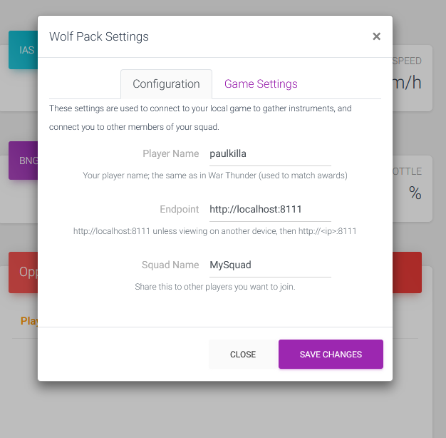
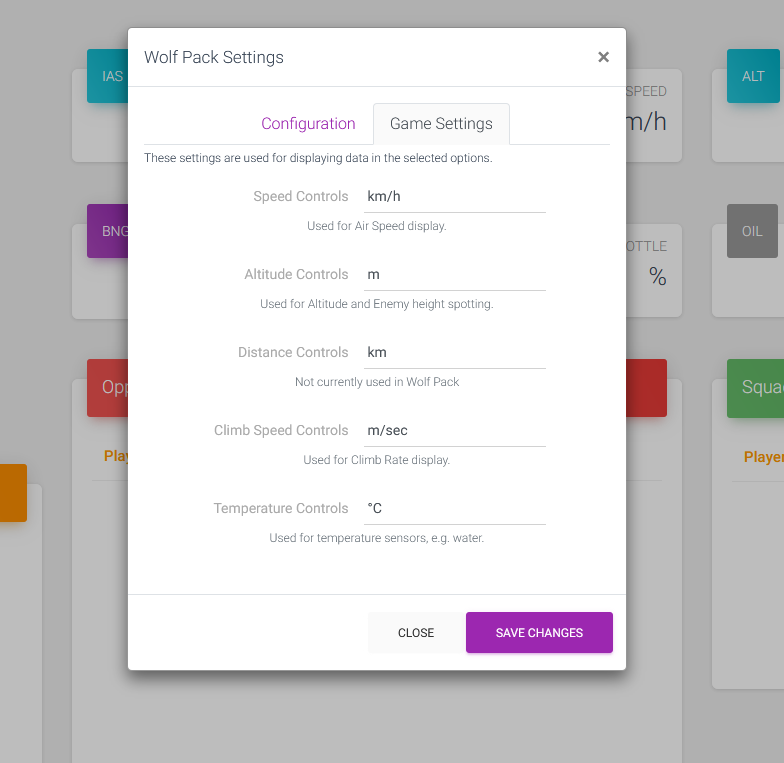
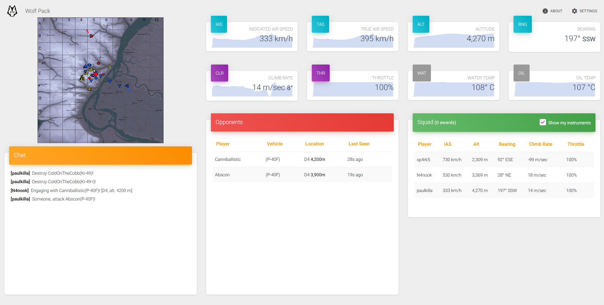
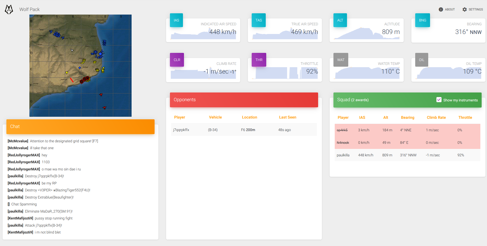

# Wolf Pack
Production hosted http://wolfpack.ws

Wolf Pack is a War Thunder Assistant that is written with squads in mind.

With Wolf Pack you can register your squad, and all be looking at the same information on another screen (tablet/monitor/phone), it will keep a list of known opponents, including their last known location and altitude. As well as showing your squad mates instruments.

### How to Join/Register a Squad
To join or register a squad, all you need to do is visit the homepage (http://wolfpack.ws) and then you get a pop-up where you want to enter in your
War Thunder username, as well as your endpoint for the War Thunder local API (By default http://localhost:8111 but if running on a machine that isn't the one running War Thunder you want this set to http://your-ip:8111), and then the Squad Name that you want to use and share with your fellow squad mates.

### Changing display readings
You can change whether to display speed in km/h mp/h or knots, as well as altitude, climb speed and temperature.

These can be changed by selecting Settings in the top right corner, and then going to the 'Game Settings' tab, where you can then choose the settings you want for each display, then select Save Changes.

### Getting opposition readings showing
Wolf Pack will show you information on opposition as you target them (By default X) then informing your team you are attacking them(By default in game having the enemy selected then t -> 1 -> 7), generally War Thunder Chat log will only show the enemy name you are attacking (and not the altitude), but if you have other members using Wolf Pack it will use the Game chat to then update the information on the Wolf Pack UI to populate the altitude.

Wolf Pack will also show the last known Grid Square, and time since the enemy was 'targetted'.

### Screenshots

## Backend

Wolf Pack communicates with the WolfPackServer (https://github.com/paulkilla/wolfpack-server)

## Development server

Run `ng serve` for a dev server. Navigate to `http://localhost:4200/`. The app will automatically reload if you change any of the source files.

